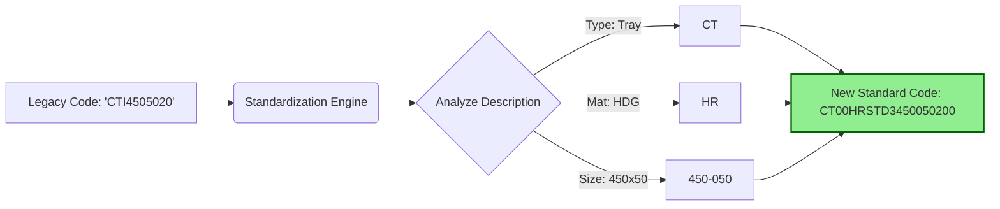
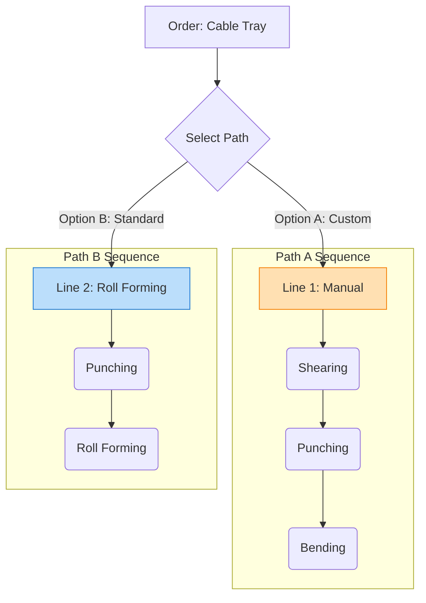

# Production System: Application Overview

## Executive Summary
This application serves as the bridge between your **Sales Demand** (PSI DB) and **Shop Floor Production**. It eliminates manual entry, automates capacity planning, and ensures 100% data traceability.

**The Core Flow:**
1.  **Sync**: Fetch **Final Work Orders** directly from the **PSI Database**.
2.  **Standardize**: Clean/Generate Smart Item Codes from the WO Description.
3.  **Route**: Map Items to specific **Production Paths** (Manual vs Automated).
4.  **Plan**: Calculate Schedules based on **Tonnage & Throughput**.
5.  **Execute**: Track live production on the shop floor.

---

## 1. Dashboard
**Screen Name**: `Dashboard`

**What You See**
*   **Capacity Heatmap**: A calendar view showing machine availability.
*   **Summary Cards**:
    *   *Pending Orders*: Number of orders waiting to be processed.
    *   *Active Jobs*: Number of jobs currently running on the floor.
    *   *Today's Output*: Total manufacturing output for the day.

**How It Works**
The system checks all active jobs and compares them against the daily limit of your machines to generate the calendar view.

---

## 2. Step 1: Receiving Orders
**Screen Name**: `Work Orders`

**Goal**: Fetch Work Orders and ensure Clean Data.

**What You See**
*   A list of **Final Work Orders** fetched directly from your **PSI Database**.
*   **Columns**: Work Order No, Client, Product Code, Description.
*   **Button**: "Process Order".

**How It Works**
1.  **Sync**: The application connects to your PSI Database and pulls new orders.
    *   *Data Fetched*: WO No, Item Code, Description, Target Qty, Due Date.
2.  **The "Standardization Engine" (Smart Feature)**:
    *   **Problem**: Legacy codes (e.g., `CTI450...`) are difficult to track.
    *   **Solution**: The system parses the **Description** from the WO and generates a **Smart ID**.
    *   **Logic**: "Cable Tray" $\to$ `CT`, "HDG" $\to$ `HR`, "450x50" $\to$ `450050`.
    *   **Result**: `CT00HRSTD3450050200` (The "New Record").

---

## 3. Step 2: Planning the Work
**Screen Name**: `Production Planning`

**Goal**: Send the right product to the right machine and calculate capacity.

**What You See**
*   Select a processed Sales Order/Work Order.
*   **Path Selector**: (e.g., Manual vs Auto).
*   **Split Tool**: Break a large order into smaller batches.
*   **Date Selection**: Pick a date for each batch.

**Logic 1: Intelligent Mapping (One Product, Multiple Paths)**
The system maps the **Product Category** (e.g., Cable Tray) to **All Valid Production Paths** defined in your Capacity Engine.

**Example: "Cable Tray" has 2 Valid Paths (A vs B)**

*   **Decision**: The Planner selects the optimal path based on Machine Availability.

**Logic 2: Detailed Sequence Samples**
The "Sequence of Operations" is determined strictly by the **Production Path** selected above.

**Sample A: If "Line 1 (Manual)" is selected:**
*   **3-Step Sequence**: Shearing (Step 1) $\to$ Punching (Step 2) $\to$ Bending (Step 3).
*   **Schedule**: Step 2 starts *after* Step 1.

**Sample B: If "Line 2 (Roll Forming)" is selected:**
*   **2-Step Sequence**: Punching (Step 1) $\to$ Roll Forming (Step 2).
*   **Schedule**: Faster throughput, fewer steps.

**Logic 3: Capacity Check (The Math)**
When you pick a date, the system runs a calculation based on **Weight (Tonnage)**.
1.  **Formula**: $$ \text{Total Weight (MT)} = \frac{\text{Qty} \times \text{Weight/Unit}}{1000} $$
2.  **Time Calculation**:
    *   *System checks speed of EACH step in the Sequence.*
    *   `Time = Weight / Machine Speed`.
3.  **Validation**:
    *   $$ \text{Load \%} = \frac{\text{Total Weight}}{\text{Line Shift Limit}} \times 100 $$
    *   If Load > 100%, the system alerts **"Overload"**.

---

## 4. Step 3: Running Production
**Screen Name**: `Production Entry`

**Goal**: Capture reality against the plan.

**What You See**
*   **Machine Selector**: Select machine (e.g., RF101).
*   **Job List**: List of jobs scheduled for today.
*   **Update Form**: Enter **"Produced Quantity"** and **"Manpower Used"**.

**How It Works**
The user enters the actual production numbers. The system saves this data, converts it to **Tonnage**, and updates the progress bar for that job.
*   **Update**: System converts 50 units $\to$ Weight $\to$ Updates **Actual Tonnage Produced**.

---

## 5. Step 4: Completion
**Screen Name**: `Job History`

**What You See**
*   A list of all jobs.
*   A **"Mark as Complete"** button appears when target quantity is reached.

**How It Works**
Clicking "Mark as Complete" closes the job, updates the status to "Completed", and removes it from the active list.

---

## 6. Audit Trail
**Screen Name**: `Activity Log`

**What You See**
*   Chronological list of system actions.
*   **Columns**: User Name, Action, Timestamp.

**How It Works**
Every addition, edit, or deletion is automatically recorded for full accountability.

---

## Summary of Benefits
1.  **Clean Data**: No more legacy code mess (Smart ID generation).
2.  **Accurate Planning**: Schedules based on **actual machine speeds (Throughput)**, not just guesswork.
3.  **Real Sequencing**: Knows that Bending must wait for Punching.
