# Production & Cashflow System: Application Overview

## Executive Summary
This application serves as the bridge between your **Sales Demand** (Spectrum DB) and **Shop Floor Production**. It eliminates manual entry, automates capacity planning, and ensures 100% data traceability.

**Key capabilities:**
1.  **Sync**: Connects directly to Spectrum to fetch Purchase Orders (`VPOTOSO`).
2.  **Clean**: Automatically standardizes your legacy Item Codes into a clean format.
3.  **Plan**: Uses "Weight-Based Capacity Checks" to prevent machine overloading.
4.  **Track**: Gives real-time visibility into production output and efficiency.

---

## 1. Dashboard
**Screen Name**: `Dashboard`

**What You See**
*   **Capacity Heatmap**: A calendar view showing machine availability.
*   **Summary Cards**:
    *   *Pending Orders*: Number of orders waiting to be processed.
    *   *Active Jobs*: Number of jobs currently running on the floor.
    *   *Today's Output*: Total manufacturing output for the day.

**How It Works**
The system checks all active jobs and compares them against the daily limit of your machines to generate the calendar view.

---

## 2. Step 1: Receiving Orders
**Screen Name**: `Sales Orders`

**What You See**
*   A list of Client Purchase Orders (POs) fetched directly from your `VPOTOSO` table.
*   **Columns**:
    *   **PO Number** (`PONO`)
    *   **Client** (`CUSTOMER`)
    *   **Product Code** (`ITCODE`)
    *   **Description** (`ITDESC`)
    *   **Status**
*   **Button**: "Process Order".

**How It Works**
1.  **Sync**: The application connects to your Spectrum database and pulls new orders.
2.  **Product "Learning" Logic**:
    *   If the **Product Code** (`ITCODE`) is known, it automatically sets the production machine.
    *   If the code is **new**, the system reads the **Description** (`ITDESC`).
        *   *Example*: It sees "CABLE TRAY" $\to$ Suggests Machine **RF101**.
    *   **Measurements**:
        *   The system scans `ITDESC` to find dimensions (e.g., "100X100") for easier identification.
        *   **Weight**: Since weight isn't in your DB, you enter the **"Weight per Unit"** once during setup. The system saves this for future calculations.
3.  **The "Standardization Engine" (Smart Feature)**:
    *   **Problem**: Your current codes (e.g., `CTI4505020`) are difficult to track.
    *   **Solution**: The system reads the description ("CABLE TRAY 450 X 50...") and **automatically generates** a clean, standardized code based on your Matrix.
    *   *Example*: `CTI4505020` $\rightarrow$ **`CT00HRSTD3450050200`**.

    *   This gives you a clean, future-proof inventory system without manual re-entry.
4.  **Result**: Click "Process Order" to import the standardized data.

---

## 3. Step 2: Planning the Work
**Screen Name**: `Production Planning`

**What You See**
*   You select a processed Sales Order.
*   **Split Tool**: A form to break a large order into smaller batches (Work Orders).
    *   *Example*: "Split the 5,000 units into 3 parts."
*   **Date Selection**: You pick a date for each batch.

**Logic: Capacity Check**
When you pick a date, the system runs a calculation:
1.  It checks which machine is needed (e.g., **RF101** for Cable Trays).
2.  It calculates how many hours the job will take based on the weight.
    *   *Formula*: `Weight (MT) / Machine Speed (MT/Hour)`.
3.  **Validation**:
    *   If the machine is free, it allows you to save.
    *   If the machine is full for that day, it shows an error: **"Capacity Exceeded"**.

```mermaid
sequenceDiagram
    participant User
    participant System
    participant CapacityRule
    
    User->>System: Plan 5,000 Units for Feb 10
    System->>CapacityRule: Get RF101 Limit
    CapacityRule-->>System: Limit = 18.4 MT / Day
    System->>System: Calc Load (18.4 MT)
    System-->>User: ✅ Capacity OK (100% Utilized)
    Note over System: If > 100%, Alert User!
```

4.  It also shows the **Manpower Required** (e.g., "4 Operators, 6 Helpers") for that shift.

---

## 4. Step 3: Running Production
**Screen Name**: `Production Entry`

**What You See**
*   **Machine Selector**: You select a machine (e.g., RF101) from a dropdown.
*   **Job List**: A list of jobs scheduled for that machine today.
*   **Update Form**: Fields to enter "Produced Quantity" and "Manpower Used" at the end of the shift.

**How It Works**
The user enters the actual production numbers. The system saves this data and updates the progress bar for that job.

---

## 5. Step 4: Completion
**Screen Name**: `Job History`

**What You See**
*   A list of all jobs.
*   When a job reaches its target quantity, a **"Mark as Complete"** button appears.

**How It Works**
Clicking "Mark as Complete" closes the job. It updates the status to "Completed" and removes it from the active list.

---

## 6. Audit Trail
**Screen Name**: `Activity Log`

**What You See**
*   A chronological list of actions taken in the system.
*   **Columns**: User Name, Action (e.g., "Created Schedule", "Updated Production"), Timestamp.

**How It Works**
Every time a user adds, edits, or deletes something, the system records it here automatically. This lets you see exactly who performed each action.

---
